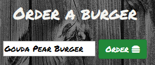

# Eat-Da-Burger

This project was a a homework assignment for SMU's coding bootcamp week 15. It is a fully functional website (hosted on heroku) that allows a user to "order" a burger, delete the burger, or "devour" burgers.

## Getting Started

* Order a burger
    * Type a name into the order form and then h it the order button
    * This name will appear on the left ready to be "devoured"
    
* Devour a burger
    * Clicking the devour button will "devour" the burger placing it under the "Burgers Devoured" list 
    
* Delete a burger
    * For any reason you want to remove a burger simply hit the delete button to remove it. 
    

## Deployment

This is fully deployed using [Heroku]
(https://smu2019eat-da-burger.herokuapp.com/)

## Built With

* [MySQL]
* [Node]
* [Express]
* [Handlebars]
* [Javascript]